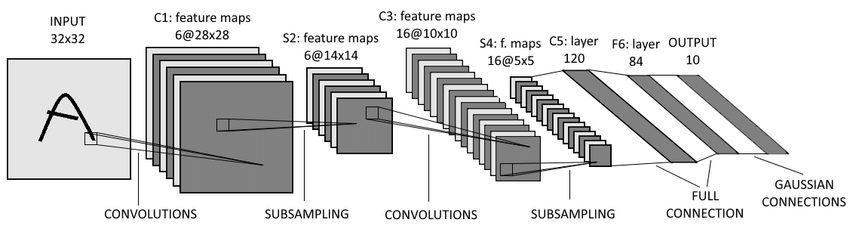

# Handwritten Digit Recognition Using Convolutional Neural Network


This repo builds a convolutional neural network based on [LENET](http://yann.lecun.com/exdb/lenet/) from scratch to recognize the MNIST Database of handwritten digits.



## Getting Started

This example is only based on the python library ```numpy``` to implement convolutional layers, maxpooling layers and fully-connected layers, also including backpropagation and gradients descent to train the network and cross entropy to evaluate the loss.

## Running the Codes

```python main.py```

In the ```main.py```, you can modify the learning rate, epoch and batch size to train the CNN from scratch and evaluate the result. Besides, there is a provided pretrained weight file ```pretrained_weights.pkl```.

```
Loadind data......
Preparing data......
Training Lenet......
=== Epoch: 0/1 === Iter:32 === Loss: 2.33 === BAcc: 0.09 === TAcc: 0.09 === Remain: 2 Hrs 32 Mins 35 Secs ===
=== Epoch: 0/1 === Iter:64 === Loss: 2.32 === BAcc: 0.06 === TAcc: 0.08 === Remain: 2 Hrs 32 Mins 37 Secs ===
=== Epoch: 0/1 === Iter:96 === Loss: 2.29 === BAcc: 0.06 === TAcc: 0.07 === Remain: 2 Hrs 31 Mins 49 Secs ===
=== Epoch: 0/1 === Iter:128 === Loss: 2.28 === BAcc: 0.12 === TAcc: 0.09 === Remain: 2 Hrs 35 Mins 49 Secs ===
=== Epoch: 0/1 === Iter:160 === Loss: 2.34 === BAcc: 0.03 === TAcc: 0.07 === Remain: 2 Hrs 31 Mins 48 Secs ===
=== Epoch: 0/1 === Iter:192 === Loss: 2.33 === BAcc: 0.09 === TAcc: 0.08 === Remain: 2 Hrs 31 Mins 14 Secs ===
=== Epoch: 0/1 === Iter:224 === Loss: 2.29 === BAcc: 0.16 === TAcc: 0.09 === Remain: 2 Hrs 32 Mins 3 Secs ===
=== Epoch: 0/1 === Iter:256 === Loss: 2.30 === BAcc: 0.16 === TAcc: 0.10 === Remain: 2 Hrs 31 Mins 47 Secs ===
=== Epoch: 0/1 === Iter:288 === Loss: 2.32 === BAcc: 0.09 === TAcc: 0.10 === Remain: 2 Hrs 31 Mins 58 Secs ===
...
```

```python app.py```

This is the demo to predict handwritten digits based on the python api ```flask``` to build a localhost website.


## Results

* learning rate: 0.01
* batch size: 100
* training accuracy: 0.94
* loss


## Blog Post
https://medium.com/deep-learning-g/build-lenet-from-scratch-7bd0c67a151e
